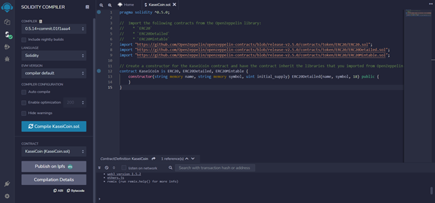
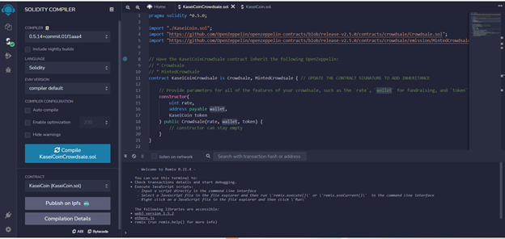
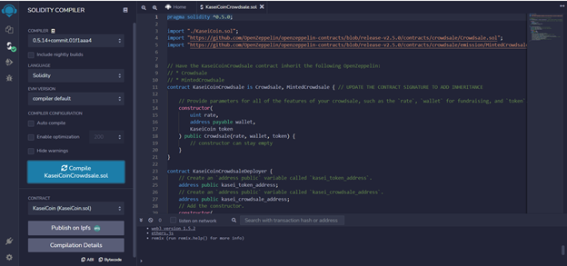
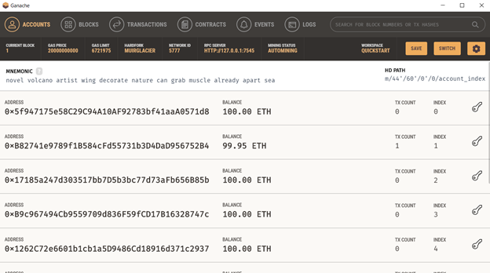
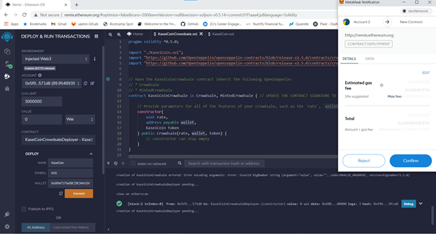
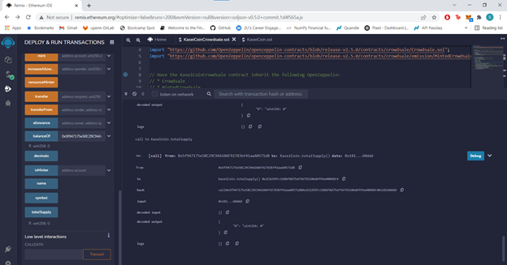
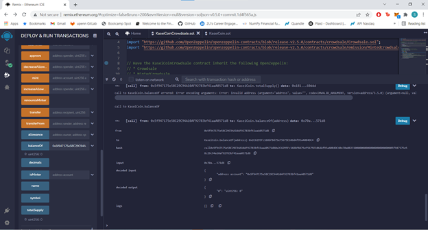

# Advanced-Solidity

In this repository I did the following:
  1. Create the KaseiCoin Token Contract
  2. Create the KaseiCoin Crowdsale Contract
  3. Create the KaseiCoin Deployer Contract
  4. Deploy and Test the Crowdsale on a Local Blockchain

